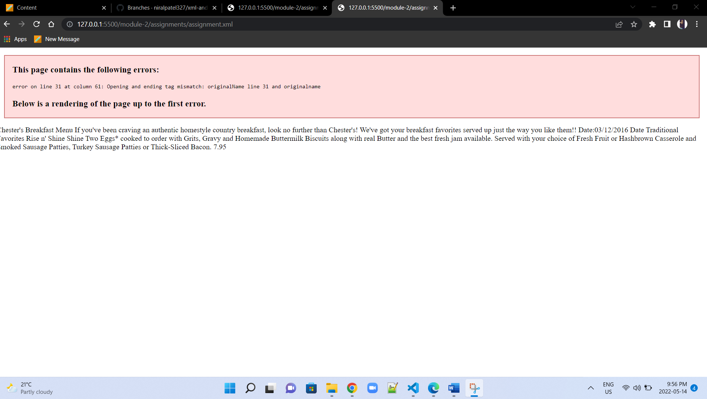
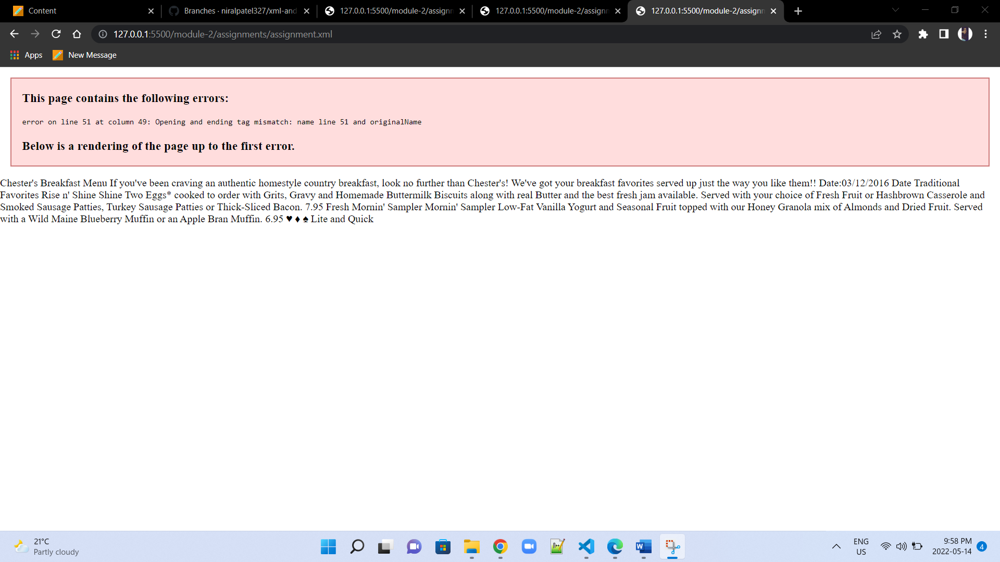
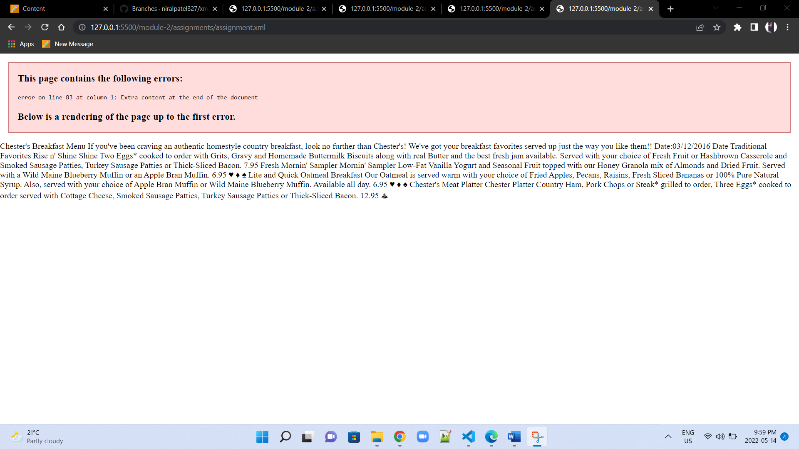
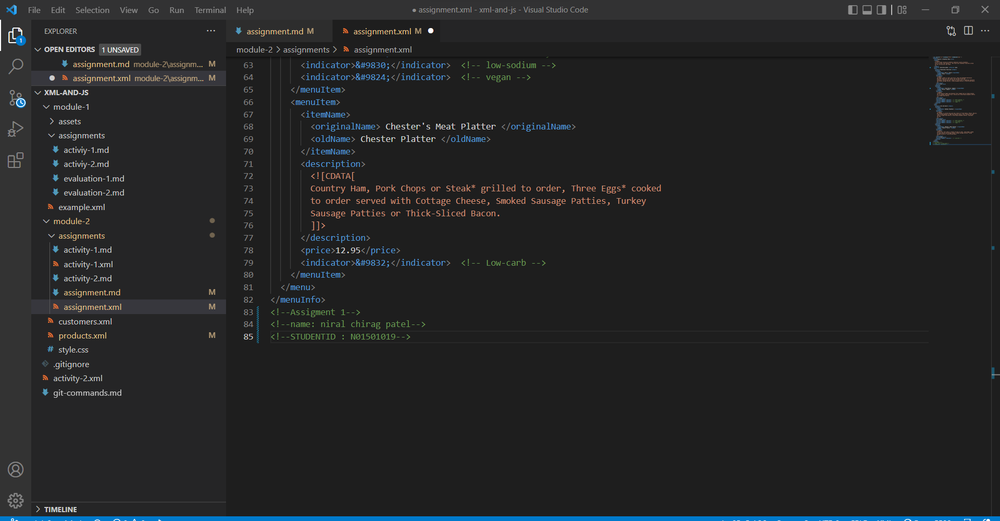
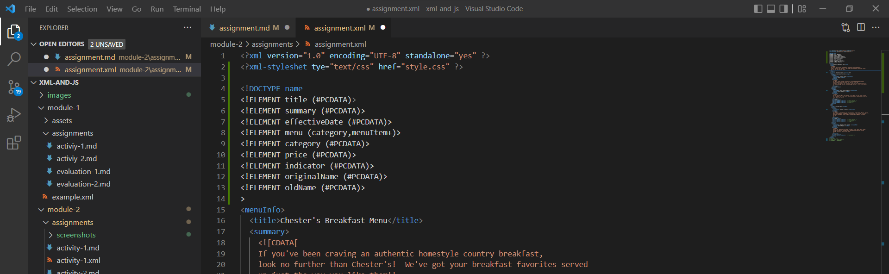
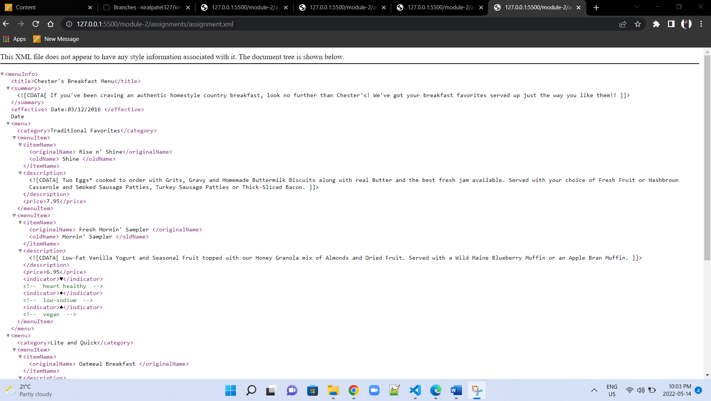
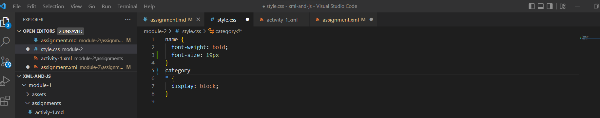
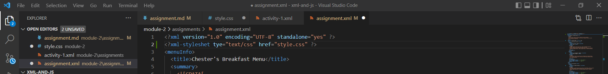

# Assignment 1

1. Open `module-2/assignments/assignment.xml` in your browser. Are there any errors? Explain the error and fix it.

2. What is the use of CDATA block in this document?
CDATA  section is used to mark a section in which you add the character data and not in the markup
3. Add comment line to the end of file which contains you name and student id.

4. Identify prolog, document body, and epilog in the document. Are there any processing instructions?
Epilog: The epilog is optional and contains any final comments or processing instructions. In, our document below image is epilog.

5. Add inline DTD for this document.

6. Verify that file is well-formed and valid.

7. Create `style.css` file and link it to the file. Add the following styles to the .css:

- Change font-size of `originalName`
- Display each `category` on the new line
- Add any other css-rule

Create `module-2/assignments/assignment_YOURNAME.md` and add your theory answers. Add screenshots of each step to the file (Refer `module-1/assignments/evaluation-1.md` on how to add image to md file)
